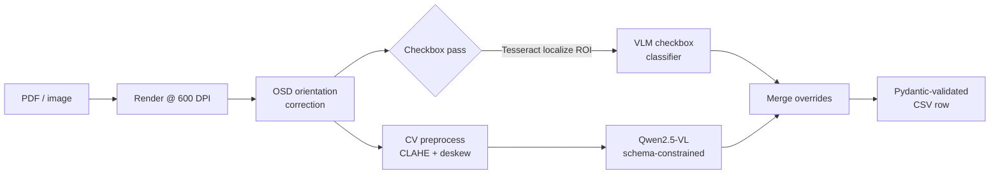

<div align="center">

# 🔒 Privacy-First Document AI

**Structured field extraction from handwritten compliance forms — using a vision-language model + classical computer vision, running 100% locally.**

[](https://github.com/VikramKavur/privacy-first-document-ai/actions/workflows/ci.yml)
[](https://www.python.org/)
[](https://github.com/astral-sh/ruff)
[](LICENSE)

</div>

---

## What it does

Messy, handwritten fire-drill / evacuation compliance forms (PDFs and scans) go in →
clean, schema-validated **CSV rows** come out. Every field — names, times, narratives,
and notoriously-hard **checkboxes** — is extracted by a pipeline that combines a
**vision-language model (Qwen2.5-VL)** with a **classical-CV front end**, with
**zero data leaving the machine**.

> **Why this is engineered the way it is:** these forms contain PHI-adjacent data from
> a regulated (developmental-disability services) setting. A cloud OCR API is a
> compliance non-starter. So the entire stack — rendering, OCR, and the VLM — runs
> locally via [Ollama](https://ollama.com). Privacy is an *architectural constraint*,
> not an afterthought.

## Why it's interesting (the engineering)

| Technique | What & why |
|---|---|
| **Constrained decoding** | The Pydantic schema is compiled to JSON Schema and passed to the model as a hard grammar (`format=...`), so the VLM is *forced* to emit valid, typed JSON — no brittle regex-scraping of free prose. |
| **Hybrid CV + VLM** | VLMs are great at reading prose but unreliable on checkboxes (they transcribe every printed option). A dedicated **Tesseract-localized checkbox classifier** crops a tight ROI per question and asks a narrow yes/no — then *overrides* the VLM for those fields. |
| **Page-aware schema sharding** | The 2-page form is split by field order into per-page partial models, so each page only decodes the fields that actually appear on it (smaller, more reliable generations). |
| **Robust scan front-end** | Tesseract OSD orientation correction → grayscale/normalize → CLAHE (recovers faint handwriting) → Hough-line deskew. Each stage is independently toggleable for **ablation studies**. |
| **Batch-robust by design** | Any single page/field failure degrades to `"NA"` and is logged — one bad scan never kills a batch run. |

## Architecture



See [`docs/ARCHITECTURE.md`](docs/ARCHITECTURE.md) for the full data flow and design rationale.

## Quickstart

**Prerequisites:** [Tesseract OCR](https://github.com/tesseract-ocr/tesseract) and
[Ollama](https://ollama.com) installed locally, with the VLM pulled:

```bash
ollama pull qwen2.5vl:7b
```

**Install & run:**

```bash
pip install -e ".[dev,eval,demo]"

# point the tool at your forms (or use the bundled synthetic samples)
export FORMEXTRACT_TESSERACT_CMD="/path/to/tesseract"   # omit if on PATH
formextract run --input data/sample --output outputs/run.csv

formextract info        # show resolved configuration
```

All configuration is environment-driven (prefix `FORMEXTRACT_`); see [`.env.example`](.env.example).

## Results

> ⚠️ **Honest status:** the original prototype reported ~82% field-level accuracy on a
> private internal set. That number is being **re-derived reproducibly** on *public,
> synthetic* forms via the evaluation harness in [`eval/`](eval) — per-field
> precision/recall/exact-match plus an ablation study quantifying each pipeline
> component's contribution. Real PHI forms are never committed (see [Privacy](#privacy--data)).

| Field group | Exact-match | Notes |
|---|---|---|
| Times / dates | _pending eval_ | structured, high-signal |
| Free-text narratives | _pending eval_ | scored by normalized edit distance |
| Checkboxes | _pending eval_ | hybrid classifier vs VLM-only ablation |

## Project structure

```
src/formextract/
  config.py         # env-driven settings (no hardcoded paths)
  schema.py         # Pydantic model = constrained-decoding grammar
  preprocessing.py  # OSD orient, CLAHE, Hough deskew (ablatable)
  ocr.py            # Tesseract spatial localization
  checkbox.py       # ROI crop + narrow VLM checkbox classifier
  vlm.py            # Qwen2.5-VL calls, page-aware schema sharding
  pipeline.py       # end-to-end orchestration
  cli.py            # `formextract` CLI (Typer)
tests/              # pytest unit tests (pure logic, no model needed)
eval/               # ground-truth + metrics + ablations  (Phase 3)
docs/               # architecture & roadmap
legacy/             # original single-file prototype (provenance)
```

## Privacy & data

- **No PHI is ever committed.** `.gitignore` blocks real forms; only synthetic,
  hand-built sample forms live under `data/sample/`.
- The full pipeline is offline-capable — useful evidence that the design actually
  honors its HIPAA-safe premise.

## Roadmap

This repo is being deliberately built to a production-portfolio standard. See
[`docs/ROADMAP.md`](docs/ROADMAP.md) for the phased plan (eval rigor, CI, demo).

## License

MIT — see [LICENSE](LICENSE).
