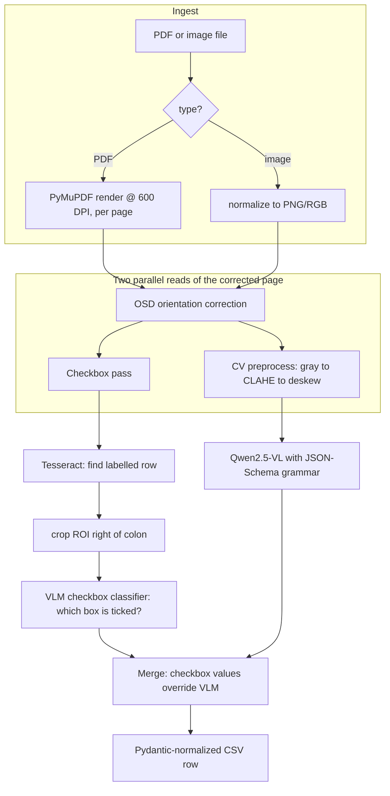

# Architecture

## Design premise

The forms carry sensitive data from a regulated (developmental-disability services)
context. The hard constraint is therefore: **no document data may leave the machine.**
Every component is chosen to run locally:

- **Rendering:** PyMuPDF (`fitz`) rasterizes PDFs at 600 DPI.
- **OCR / localization:** Tesseract (LSTM engine, `--oem 1`).
- **Vision-language model:** Qwen2.5-VL 7B served by Ollama.

There is no network egress in the hot path.

## Data flow

## Why two reads of the same page?

The checkbox pass runs on the **orientation-corrected** image, *not* the
CV-preprocessed one. Deskew and CLAHE shift/insert pixels that move the spatial
anchors Tesseract relies on to locate a checkbox row. The VLM extraction, by
contrast, benefits from the contrast-enhanced, deskewed image. So the two
consumers get the image each one wants.

## Key design decisions

### 1. Constrained decoding over prompt-and-pray
The Pydantic schema (`schema.py`) is compiled to JSON Schema and passed to Ollama
as `format=...`. This makes malformed output structurally impossible rather than
something we clean up after the fact. `parsing.parse_model_json` remains as a
defensive backstop (fences/prose stripping) but is rarely exercised.

### 2. A separate model call for checkboxes
General-purpose VLMs reliably *read* printed checkbox labels but unreliably *judge*
which box is ticked — they tend to return every option. Cropping a tight ROI and
asking a single, narrow question ("which of these is marked? return NA if unsure")
is dramatically more reliable, and the single-/multi-select coercion rules
(`checkbox._coerce_selection`) reject ambiguous multi-mark cases instead of guessing.

### 3. Page-aware schema sharding
A 30-field, 2-page form is split by field order (`vlm.get_partial_model_for_page`,
24 fields on page 1, 6 on page 2). Each page decodes a smaller schema, which keeps
generations focused and reduces cross-page hallucination.

### 4. Fail soft, log loud
Every external call (OCR, VLM, image read) is wrapped so a single failure degrades to
`"NA"` and a warning, never a crashed batch. This is the right trade-off for
overnight batch processing of hundreds of forms.

## Known issues / error-analysis hooks

- **Ambiguous checkbox anchors.** `Evacuation_Type` (`["evacuation","type"]`) and
  `Type_of_Evacuation` (`["type","evacuation"]`) are identical as keyword *sets*, and
  matching is order-insensitive — so both can resolve to the same row. This is exactly
  the kind of bug the Phase 3 evaluation harness is designed to surface and quantify
  before it gets "fixed by vibes."
- **DPI/latency trade-off.** 600 DPI improves faint-handwriting recall but is slow;
  the ablation study will quantify the accuracy delta vs 300 DPI.
